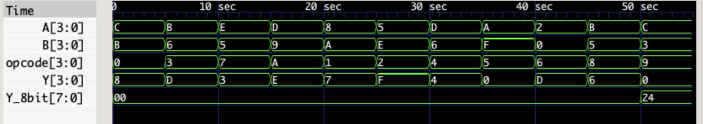

# ALU Functions and Control Circuit

## Overview

This project involves the design and implementation of an Arithmetic Logic Unit (ALU) with a range of operations using Verilog. Over the semester, we developed various 4-bit gates and built upon them to create a comprehensive Control Circuit. The project culminates in the development of the `integratedModule` Verilog code, which performs a variety of 4-bit operations based on the provided opcode input.

## Leftover Group Members:
- **Luis Herrera:**
  - Added the Addition, Subtraction, and Multiplication gates.
  - Created the complete Control Circuit and Test Bench.
  - Documented the findings using LaTeX.
  
- **Alex Kaylor:** Provided initial 4-bit gates prior to leaving the class.
- **Philip Ervin:** Provided descriptions of the gate circuits and test bench results.

## Project Components

### 4-bit Gate Modules

1. **AND Gate**
2. **NAND Gate**
3. **OR Gate**
4. **XOR Gate**
5. **XNOR Gate**
6. **NOR Gate**
7. **NOT Gate**
8. **SHIFTER**
9. **ADDER**
10. **SUBTRACTOR**
11. **MULTIPLIER**

### Verilog Module: `integratedModule`

The `integratedModule` is the central control circuit designed to execute various 4-bit operations based on the opcode input. It includes the following modules:

- **AND**
- **NAND**
- **OR**
- **XOR**
- **XNOR**
- **NOR**
- **NOT**
- **SHIFTER**
- **ADDER**
- **SUBTRACTOR**
- **MULTIPLIER**

#### Inputs and Outputs

- **Inputs:**
  - `opcode`: A 4-bit input that determines the operation to be performed.
  - `Cin`: Carry-in input for addition and subtraction operations.

- **Outputs:**
  - `Y`: A 4-bit output representing the result of the operation.
  - `Y-8bit`: An 8-bit output used for results of multiplication operations.
  - `Cout`: Carry-out output for addition and subtraction operations.

#### Opcode Functionality

- `0000` (Bit 0): AND Operation
- `0001` (Bit 1): NAND Operation
- `0010` (Bit 2): OR Operation
- `0011` (Bit 3): XOR Operation
- `0100` (Bit 4): XNOR Operation
- `0101` (Bit 5): NOR Operation
- `0110` (Bit 6): NOT Operation
- `0111` (Bit 7): ADD Operation
- `1000` (Bit 8): SUBTRACTION Operation
- `1001` (Bit 9): MULTIPLICATION Operation
- `1010` (Bit 10): SHIFTER Operation

## Simulation and Verification

The design was verified using GTKWave to observe the results and ensure correct functionality of the `integratedModule`. Various test cases were run to validate the operations and outputs of the ALU.

## Documentation

A comprehensive report detailing the project, including design decisions, simulation results, and conclusions, was created using LaTeX. The report provides an in-depth analysis of the implementation and performance of the ALU functions and the control circuit.
